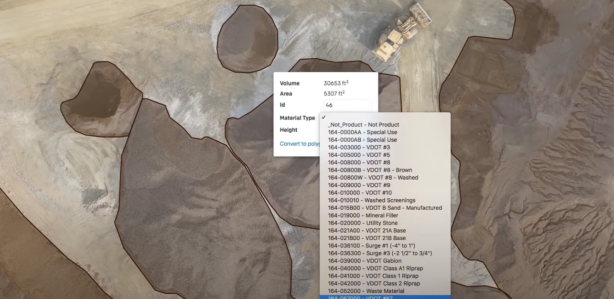

I have chosen Delair as a company. Delair has created a Aerial Intelligence Cloud Platform. It's a Drone Data Analyrics for Mines and Aggregates. 

<iframe width="560" height="315" src="https://www.youtube.com/embed/fp7Sus5MGQY" frameborder="0" allow="accelerometer; autoplay; clipboard-write; encrypted-media; gyroscope; picture-in-picture" allowfullscreen data-external="1"></iframe>

## What was the business problem?

Improving the margin in mining industry. Margin in the mining industry are very thin. [Source](https://www.statista.com/statistics/208725/net-profit-margin-of-the-top-mining-companies/#:~:text=For%202019%2C%20it%20means%20that,every%20U.S.%20dollar%20they%20earned.&text=The%20average%20net%20profit%20margin%20of%20the%20world's%20top%2040,to%20nine%20percent%20in%202019.) In this source it states that for 2019, it means that the top 40 mining companies kept nine cents of profit out of every U.S. dollar they earned.

## How was it translated into a data mining problem?

In order for Belair to improve the bottom line they introduce a complete drone based analytics solution to proces, view and share the drone surveys. These aerial data can be used to make calculations on expected volume of an area. Like a advanced volumetric toolset. all kinds of data is collected from the camera sensors in the drone. It gives the customers a wide arrange of tools.

## What is the realized business value?

aerial views for big industry in the raw meterials industry can benefit by using relatively cheap aerial survailance with advanced sensors to measure and prepare their best course of action. You can image when setting up a big mining machine (like in the image below)in the wrong area can result in down time for the machines. Also the use drone in comparison to conventional aerial mapping techniques (Satelites) is expected to be 50 time faster than. This gives great flexibility. 

Example of solutions given in the video:

1. Save money on accurate measurements, which results in better billing procedures. 
2. During development of a mining site using the tools to optimize the design and equipement selection.
3. Regarding safety and regulatory concerns. Used the aerial footage and measurements to inspect the width of the road and possible workflow bottlenecks regarding this.

Image: 

